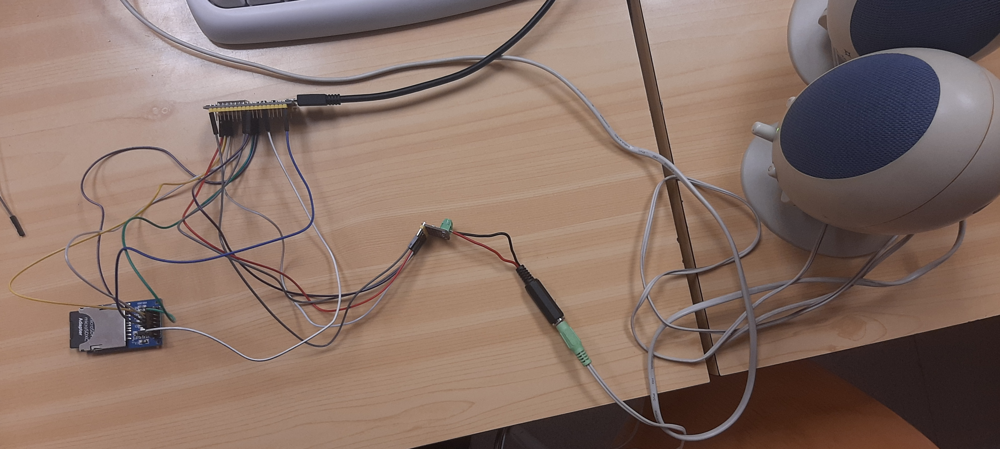

# Practica 7 parte 3

## Código
```c++
#include "Audio.h"
#include "SD.h"
#include "FS.h"
// Digital I/O used
#define SD_CS 5
#define SPI_MOSI 23
#define SPI_MISO 19
#define SPI_SCK 18
#define I2S_DOUT 25
#define I2S_BCLK 27
#define I2S_LRC 26

Audio audio;

void setup(){
  pinMode(SD_CS, OUTPUT);
  digitalWrite(SD_CS, HIGH);
  SPI.begin(SPI_SCK, SPI_MISO, SPI_MOSI);
  Serial.begin(115200);
  SD.begin(SD_CS);
  audio.setPinout(I2S_BCLK, I2S_LRC, I2S_DOUT);
  audio.setVolume(10); // 0...21
  audio.connecttoFS(SD, "archivo.wav");
}
void loop(){
audio.loop();
}
// optional
void audio_info(const char *info){
Serial.print("info"); Serial.println(info);
}
void audio_id3data(const char *info){ //id3 metadata
Serial.print("id3data");Serial.println(info);
}
void audio_eof_mp3(const char *info){ //end of file
Serial.print("eof_mp3");Serial.println(info);
}
void audio_showstation(const char *info){
Serial.print("station");Serial.println(info);
}
void audio_showstreaminfo(const char *info){
Serial.print("streaminfo ");Serial.println(info);
}
void audio_showstreamtitle(const char *info){
Serial.print("strea28/4/2021mtitle ");Serial.println(info);
}
void audio_bitrate(const char *info){
Serial.print("bitrate");Serial.println(info);
}
void audio_commercial(const char *info){ //duration in sec
Serial.print("commercial ");Serial.println(info);
}
void audio_icyurl(const char *info){ //homepage
Serial.print("icyurl");Serial.println(info);
}
void audio_lasthost(const char *info){ //stream URL played
Serial.print("lasthost");Serial.println(info);
}
void audio_eof_speech(const char *info){
Serial.print("eof_speech ");Serial.println(info);
}
```

## Descripción

Este es un programa diseñado para reproducir un archivo de audio que se encuentra en una tarjeta SD usando un I2S.

Hemos incluido la librería "Audio.h" para el audio, la "SD.h" para la tarjeta SD y la "FS.h" para parmitir el accesso al sistema de archivos. 

Se definen los pines que se van a usar para comunicarse con la tarjeta y los pines de la conexión I2S para la salida del audio. Luego se crea un objeto audio que usará las funciones de la libreria Audio.

Se confugura el pin como saluda y se pone en alto. Se inicializa la comunicación SPI con los pinses cofigurados, inicializa la tarjeta y el I2S. Establece el volumen del audio, conecta el sistema de archivos y selecciona el archivo de audio "archivo.wav" para reproducirlo.

En el bucle se asegura de que el audio siga reproduciendose.

También se añaden algunas funciones opcionales que durante la reproducción del audio imprimen información por el puerto serie.

### Diagrama de flujos:

```mermaid
graph TD
    A[Inicio] --> B[Configurar el Pin SD_CS]
    B --> C[Inicializar SPI]
    C --> D[Inicializar Serial]
    D --> E[Montar la Tarjeta SD]
    E --> F[Configurar Pines I2S]
    F --> G[Establecer Volumen]
    G --> H[Conectar a Archivo de Audio]
    H --> I[Fin de la Configuración Inicial]
    I --> J[Ejecutar Reproducción de Audio]
    J --> J

    %% Funciones Opcionales de Depuración
    J --> K[audio_info]
    J --> L[audio_id3data]
    J --> M[audio_eof_mp3]
    J --> N[audio_showstation]
    J --> O[audio_showstreaminfo]
    J --> P[audio_showstreamtitle]
    J --> Q[audio_bitrate]
    J --> R[audio_commercial]
    J --> S[audio_icyurl]
    J --> T[audio_lasthost]
    J --> U[audio_eof_speech]

```
### Foto del montaje:




## Conclusión

En conclusión este código configura un ESP32 para reproducir un archivo de audio que se encuentra en una tarjeta SD usando una conexión I2S. La confoguración de pines y la inicialización de estos y de las librerías necesarias se realiza en la función **setup()** y en la función **loop()** se maneja la reproducción de audio. El audio se reproducirá en bucle al mismo tiempo que se proporcionará distinta información de este por el puerto serie.
