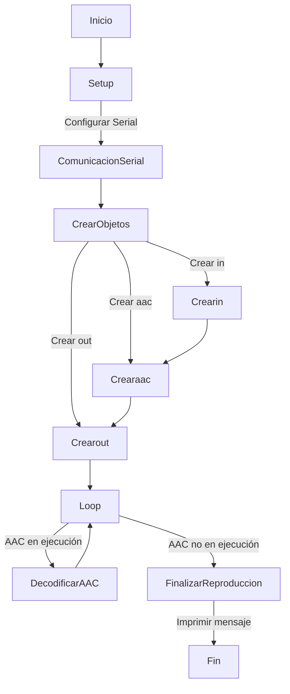

# Práctica 7 parte 1

## Código

```c++

#include <Arduino.h>
#include "AudioGeneratorAAC.h"
#include "AudioOutputI2S.h"
#include "AudioFileSourcePROGMEM.h"
#include "sampleaac.h"

AudioFileSourcePROGMEM *in;
AudioGeneratorAAC *aac;
AudioOutputI2S *out;

void setup()
{
  Serial.begin(115200);

  audioLogger = &Serial;
  in = new AudioFileSourcePROGMEM(sampleaac, sizeof(sampleaac));
  aac = new AudioGeneratorAAC();
  out = new AudioOutputI2S();

  aac->begin(in, out);
}


void loop()
{
  if (aac->isRunning()) {
    aac->loop();
  } else {
    Serial.printf("AAC done\n");
    delay(1000);
  }
}

```
## Descripción

Hemos usado este código para la reproducción de un archivo de audio.

Primero hemos añadido la libreria ESP8266Audio para poder manejar la fuente de audio. Las librerias usadas decodifican el archivo y envian el audio a través del I2S.

Usamos un objeto AudioFileSourcePROGREM llamado in para acceder al archivo de audio almacenado en la memoria PROGREM. Luego creamos un objeto AudioGenerator AAC llamado acc para decodificar el archivo de audio AAC y creamos otro objeto AudioOutput llamado out para enviar el audio decodificado al dispositivo de salida de audio a través del I2S.

En el bucle principal del programa verificamos si el decodificador AAC está en ejecución usando la función **isRunning()** de la clase AudioGEneratorAAC. Si este está en ejecución se llama al metodo **loop()** de la clase AudioGeneratorAXX para procesar datos de audio. Si el decodificador ha terminado de reproducir el archivo de audio, se imprime un mensaje indicando que la reproducción ha finalizado y se espera un segundo antes de volver al bucle.

### Diagrama de flujos



## Conclusión

En conclusión este código reproduce un archivo de audio AAC en Arduino usando librerias especializadas para acceder al archivo de audio, decodificarlo y enviarlo al dispositivo encargado de la salida de audio.
